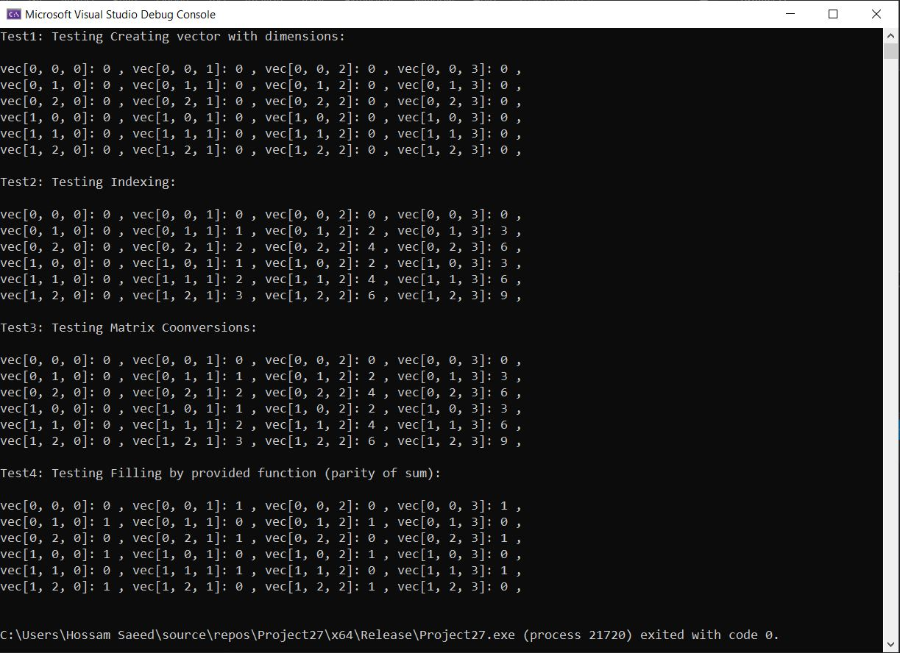

# Task 3 - Algo

### Requirements
1. Create a 1D vector suitable for storing the 3D matrix.
2. Convert the 3D matrix index (i, j, k) to a suitable 1D vector index (y). Must be O(1).

### Solution
As in Task3.cpp, I have implemented a `Flattened3DMat` class. It can create a vector from an already created 3D matrix or a dimension specification.
I have also implemented `at(i,j,k)` which is used for indexing (both reading and writing). 
In addition to this, I implemented some other helper functions for conversion from and to a 3D matrix and a function to fill the vector according to a passed function in terms of `i, j, k`.

### Results

I have tested all functions in the main function and the results above were all as expected.